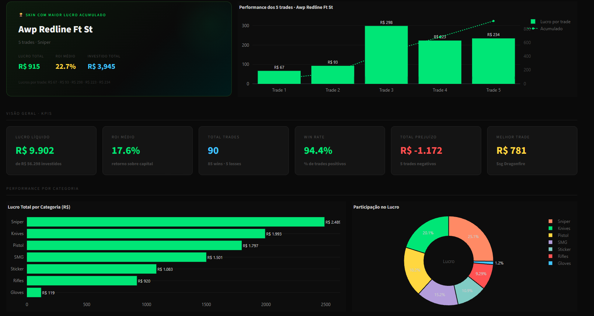
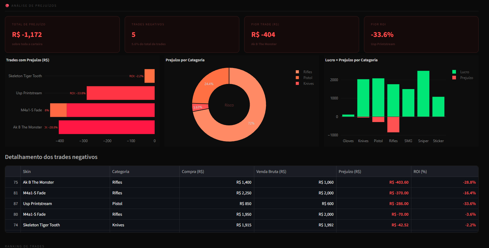
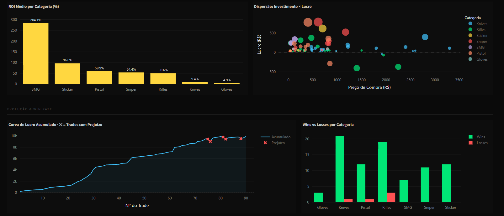

# 📊 CS2 Skins · Trading Dashboard

> Um dashboard de análise de performance para operações de compra e venda de skins do Counter-Strike 2, construído com Python, Streamlit e Plotly.

---

## 🖥️ Preview







---

## 💡 Sobre o Projeto

Este projeto nasceu de uma necessidade real: acompanhar e entender o desempenho das minhas operações de trading de skins do CS2 de forma visual e analítica.

Os dados são registrados manualmente em uma planilha Excel (preço de compra, preço de venda, taxa da plataforma, lucro líquido) e o dashboard transforma esses números em inteligência visual — revelando padrões de acerto e erro, ROI por categoria, evolução do capital e muito mais.

---

## ✨ Funcionalidades

- **Hero "Sobre o Projeto"** com métricas gerais em tempo real
- **KPI Cards** — Lucro líquido, ROI médio, Win Rate, Total de trades
- **Destaque da Skin mais lucrativa** com gráfico de performance por trade
- **Curva de Capital Acumulado** com marcadores de trades negativos
- **Wins vs Losses por Categoria** — gráfico de barras agrupadas
- **Análise de Prejuízos** — top piores trades, prejuízo por categoria, tabela detalhada
- **Top 10 Melhores Trades & Maior ROI**
- **Histograma de Distribuição de Resultados**
- **Ranking Completo** com tabela filtrável e exportável
- **Filtros dinâmicos** — ao filtrar por Lucro, a seção de Prejuízo some automaticamente (e vice-versa)
- **Design dark editorial** com UI totalmente responsiva

---

## 🛠️ Stack

| Tecnologia | Uso |
|---|---|
| Python | Linguagem principal |
| Streamlit | Framework de interface web |
| Plotly | Gráficos interativos |
| Pandas | Manipulação e análise de dados |
| OpenPyXL | Leitura do arquivo Excel |
| Excel (.xlsx) | Fonte de dados |

---

## 📁 Estrutura do Projeto

```
ProjetoSkinsCS2/
│
├── dashboard_cs2.py     # Aplicação principal
├── skinsCS2.xlsx        # Planilha de dados
├── requirements.txt     # Dependências
└── README.md
```

---

## ☁️ Deploy
 
O projeto está publicado no **Streamlit Community Cloud** e pode ser acessado pelo link abaixo:
 
🔗 **https://projetoskinscs2.streamlit.app/**

---

## 📌 Aprendizados

- Manipulação e agregação de dados com **Pandas**
- Criação de gráficos interativos com **Plotly Graph Objects**
- Construção de UI condicional e filtros dinâmicos com **Streamlit**
- Aplicação de conceitos de **UX em dashboards de dados**
- Design de interfaces dark com **CSS customizado dentro do Streamlit**

---

## 👤 Autor

**Fabrício Formentini**

Estudante de Análise e Desenvolvimento de Sistemas · Niterói, RJ

[](https://linkedin.com/in/fformentini)
[](https://github.com/fformentini)

---

## 📄 Licença

Este projeto está sob a licença MIT. Veja o arquivo [LICENSE](LICENSE) para mais detalhes.
